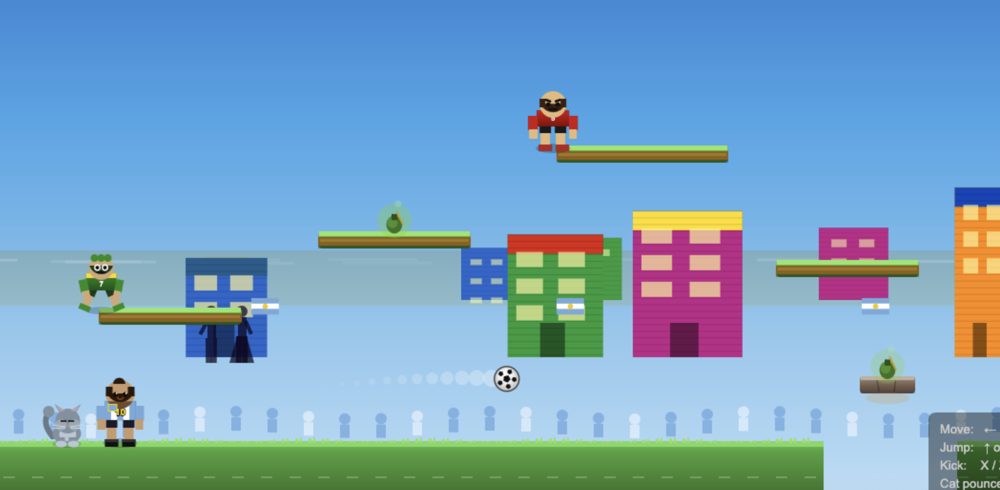

# Messi Quest 2D platform game

[MessiQuest](https://ajl2718.github.io/messiquest/)

A game I created (with the help of Claude Code) for my nephew that involves his two favourite things: Lionel Messi and a cat.

## Gameplay
The main character is Messi, who can kill baddies by either kicking them with a soccer ball or by throwing a cat at them. The cat is Messi's constant companion, and the ball always returns (well, except for the occasional bug where it gets stuck and never returns). 

There are three levels and a boss at the end of each one. 

## 🧉 Mate
You can collect mate (a favourite beverage among Argentinians) along the way. After five mates you acquire another life. 

## Points

- Kill a baddy with the cat = 150
- Kill a baddy with the soccer ball = 100 points

## How to play

Simply visit [MessiQuest](https://ajl2718.github.io/messiquest/), or alternatively, you can download the html file and run locally.